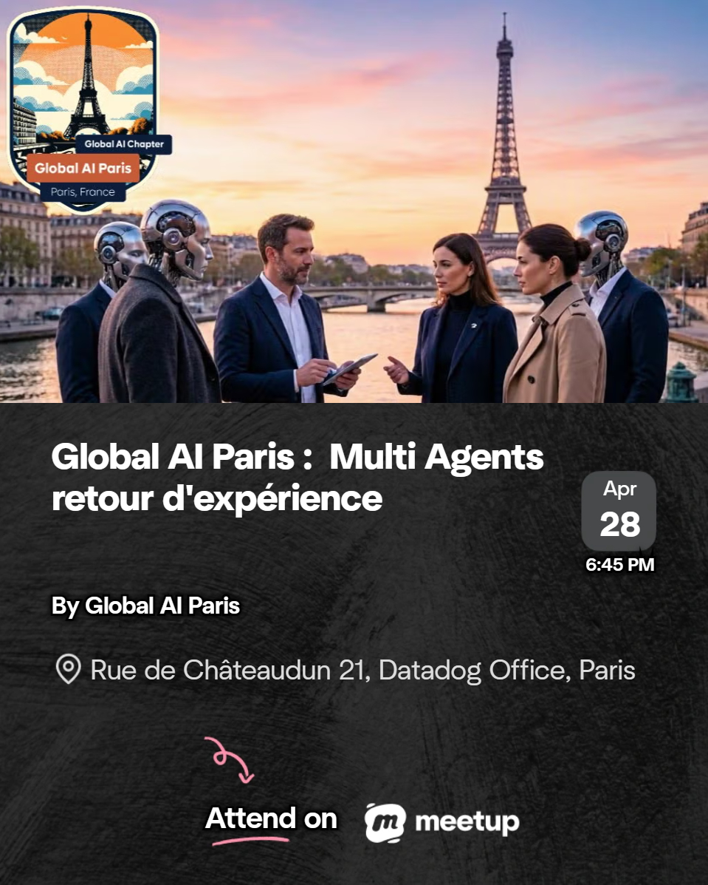
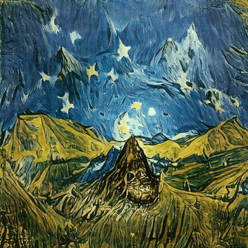

  

<h1 align="center">Aymeric Weinbach · ZeCloud</h1>

  <strong>Microsoft MVP · AI &amp; Azure</strong> 
  Cloud, IA et communauté : explorer, construire et partager.

  <a href="https://www.zecloud.fr/">Blog</a> ·
  <a href="https://academy.zecloud.fr/">ZeCloud Academy</a> ·
  <a href="https://www.zecloud.fr/Training/">Training Hub</a> ·
  <a href="https://poppyrate.zecloud.fr/">Poppyrate</a> ·
  <a href="https://www.zecloud.fr/lascension-des-agents-lia-passe-a-laction/">Conférences</a> ·
  <a href="https://www.zecloud.fr/snake/">Jouer au Snake</a>

## 👋 Bonjour / Hello

J’explore l’IA et le cloud en partageant du code, des expérimentations et des
conférences. Mon objectif : rendre les idées techniques concrètes et accessibles
aux développeurs.

*I share hands-on projects, talks and resources about AI, cloud and developer communities.*

**Mes terrains d’exploration :** IA générative et agents · MCP · Azure et
serverless · robotique.

## 🧪 Du code pour explorer

- **[MCP Image AI Foundry](https://github.com/zecloud/MCP_Image_AIFoundry)** —
  un serveur MCP sur Azure Functions pour générer et modifier des images avec
  Azure AI Foundry.
- **[MCP vidéo et musique](https://github.com/zecloud/mcp-video-generation-functions)** —
  des workflows de génération orchestrés avec Azure Functions et Durable Task Scheduler.
- **[Ghost MCP sur Azure](https://github.com/zecloud/ghost-mcp-azure)** —
  une adaptation sur Azure Functions d’un serveur MCP pour interagir avec Ghost CMS.
- **[Poppyrate](https://poppyrate.zecloud.fr/)** —
  un robot humanoïde open source dérivé de Poppy, au squelette imprimé en 3D,
  conçu pour rendre la robotique éducative plus accessible et abordable.

[Découvrir tous mes dépôts →](https://github.com/zecloud?tab=repositories)

## 🎤 Conférences, meetups et ressources

- **[Global AI Paris · Multi-agents : retour d’expérience](https://www.meetup.com/global-ai-paris/events/314294163/)** —
  le 28 avril 2026, autour des architectures multi-agents. J’y ai présenté les
  actualités Microsoft Foundry, GitHub Copilot et Microsoft Agent Framework.
  [Voir le replay](https://youtu.be/pCAtDlzDuXw).

  

- **[L’ascension des agents : l’IA passe à l’action](https://www.zecloud.fr/lascension-des-agents-lia-passe-a-laction/)** —
  une sélection de conférences sur les agents IA et leurs frameworks.

  

- **[Serverless Everywhere · Devoxx France 2021](https://www.zecloud.fr/serverless-everywhere-devoxx-fr-2021/)** —
  la vidéo, les slides et le code de la session.

  

- **[ZeCloud Academy](https://academy.zecloud.fr/)** —
  apprendre plus vite avec un coach IA personnel.
- **[Training Hub](https://www.zecloud.fr/Training/)** —
  les slides et quiz des parcours générés avec ZeCloud Academy.

## 🤝 Échangeons

Une question, une idée ou un retour sur un projet ? Ouvre une issue dans le dépôt
concerné : les échanges et les contributions sont les bienvenus.

## 🐍 Une contribution, une case à croquer

Une petite pause sur ma grille publique de contributions GitHub. C’est un
**instantané**, pas un compteur en temps réel.

<picture>
  <source media="(prefers-reduced-motion: reduce)" srcset="./assets/contributions-static.svg">
  
</picture>

[Voir la grille statique](./assets/contributions-static.svg) ·
[Jouer au Snake](https://www.zecloud.fr/snake/) ·
[Code du jeu](https://github.com/zecloud/snake)
